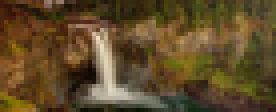

## Hi, I am Max!

Currently studying C/C++ at Hive Helsinki and Computational Science at LUT.  
Building things in Go, Python, and whatever fits the problem.

---

### Technologies I've worked with

---

### Activity

